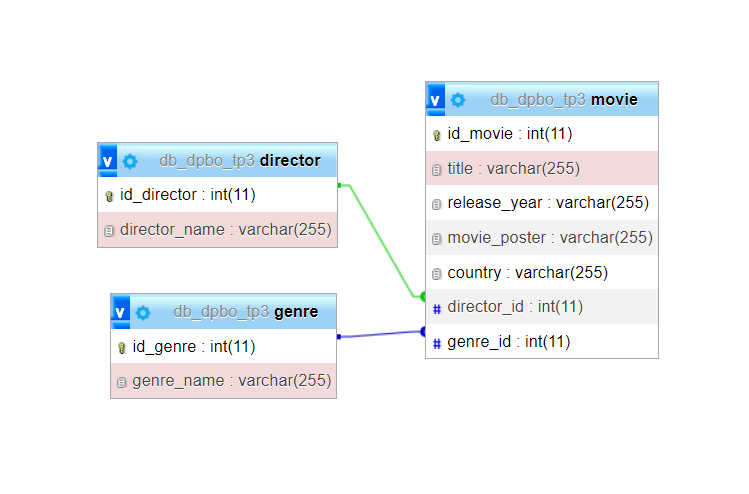

# TP3DPBO2023
Tugas Praktikum 3 Mata Kuliah Desain dan Pemrograman Berorientasi Objek. Program CRUD sederhana dengan PHP GUI.

Saya Najma Qalbi Dwiharani dengan NIM 2102843 mengerjakan soal TP 3 dalam mata kuliah Desain dan Pemrograman Berorientasi Objek untuk keberkahanNya maka saya tidak melakukan kecurangan seperti yang telah dispesifikasikan. Aamiin.

## Desain

  

## Alur Program

Pada program ini terdapat lima halaman/page:

### 1. Halaman Utama

- Berisi daftar movie/film dengan judul, poster, genre, dan director
- Daftar movie/film dapat diurutkan secara ascending atau descending menggunakan tombol sort pada navbar
- Dapat mencari movie/film berdasarkan nama dengan fitur search
- Ketika movie/film di-klik maka dapat berpindah ke halaman movie detail

### 2. Halaman Movie Detail

- Berisi detail movie/film
- Dapat menghapus dan mengupdate detail film

### 3. Halaman Add/Update Movie

- Form untuk menambah movie baru
- Jika digunakan untuk update maka akan menampilkan data lama yang telah tersimpan

### 4. Halaman List Genre

- Berisi daftar genre dan form untuk menambah genre baru
- Daftar genre dapat diurutkan secara ascending atau descending menggunakan tombol sort pada navbar
- Dapat mencari genre berdasarkan nama dengan fitur search
- Dapat menghapus dan mengupdate genre
- Jika form digunakan untuk update maka akan menampilkan data genre lama

### 4. Halaman List Director

- Berisi daftar director dan form untuk menambah director baru
- Daftar director dapat diurutkan secara ascending atau descending menggunakan tombol sort pada navbar
- Dapat mencari director berdasarkan nama dengan fitur search
- Dapat menghapus dan mengupdate director
- Jika form digunakan untuk update maka akan menampilkan data director lama

## Dokumentasi

https://github.com/najmharani/TP3DPBO2023C1/assets/90398797/f0fe7f16-d05c-45f9-9859-87b432b562df

  
